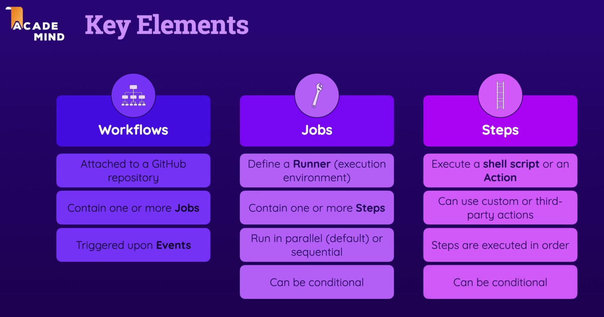
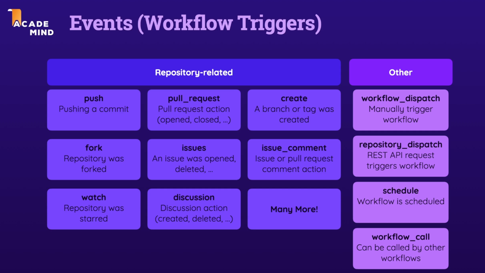
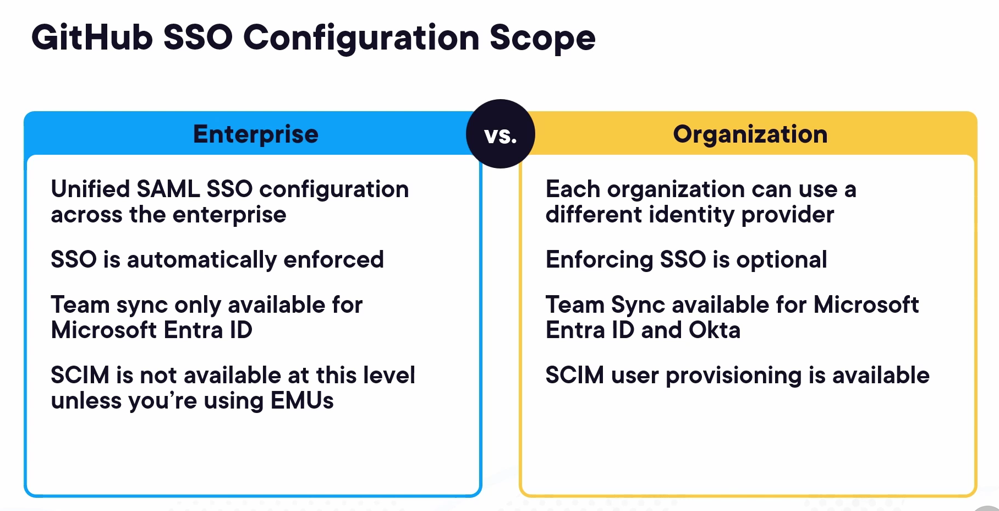

# Github-Actions


### GitHub Actions Overview

**Workflow**: A workflow is an automated process that you define in your GitHub repository. It is made up of one or more jobs and can be triggered by events such as push, pull request, or on a schedule.

**Jobs**: A job is a set of steps that execute on the same runner. Jobs run in parallel by default, but you can configure dependencies between jobs to control the order of execution.

**Actions**: Actions are individual tasks that are combined as steps to create a job. GitHub provides a marketplace of reusable actions, or you can create your own.

### How They Are Connected


- **Workflow**: Defines the automated process and contains jobs.
- **Jobs**: Sets of steps that run on the same runner, defined within workflows.
- **Actions**: Individual tasks executed as steps within jobs.




By understanding these components and how they are connected, you can effectively create and manage CI/CD pipelines using GitHub Actions.

```yaml
name: first-workflow
on: workflow_dispatch
jobs:
  first-job:
    runs-on: ubuntu-latest
    steps:
      - name: Print Greeting
        run: echo "Hello World"
      - name: Print Goodbye
        run: echo "Bye-Goodbye"
```


**workflow_dispatch**: This will let the workflow run manually.




---

**Event Triggers** , **with**, **needs**
-----------------------------------------

- There are multiple event triggers ranging from **workflow_dispatch** , **push**, **pull**, **schedule**, **REST API call** etc....
- There is a **with** keyword where in in a specific action , you can specify node version which you wish to use incase of enforcing a specific version you wish to use
- **needs** is another key parameter which you can specify to mention a dependent job , where a dependent job needs to wait on some preceding job.
 
```yaml

name: Workflow
on: [push,workflow_dispatch]
jobs:
  build:
    runs-on: ubuntu-latest
    steps:
      - uses: actions/checkout@v3
      - name: Run a one-line script
        run: echo Hello, world!
      - uses: actions/setup-node@v3
        with:
          node-version: '16'
      - name: Run a multi-line script
        run: |
          npm ci
          npm run build
          npm test
  deploy:
    needs: build
    runs-on: ubuntu-latest
    steps:
      - uses: actions/checkout@v3
      - name: Deploy to production
        run: echo Deploying to production...    

```


---

# GitHub Administration





